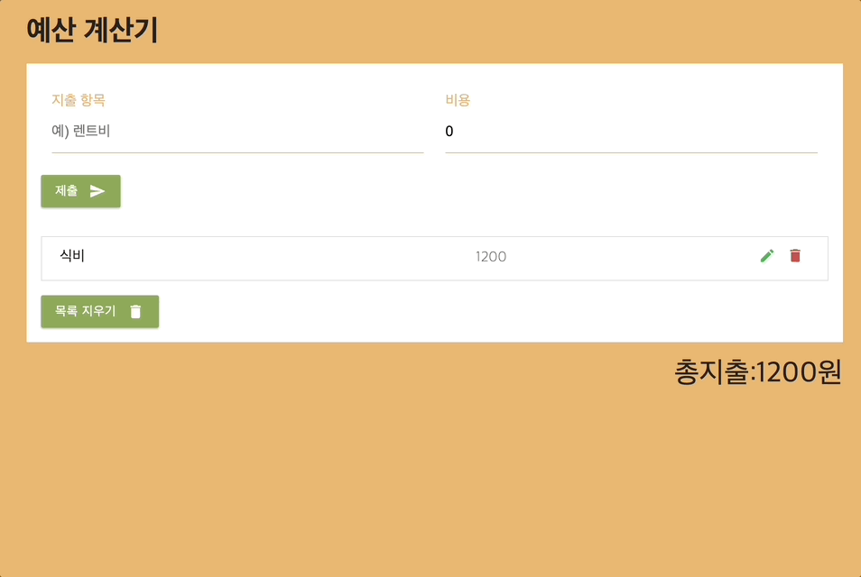

>
[👉 배포 페이지 바로가기](https://sj70.github.io/Budget_Calculator/)

# 05. 리액트를 이용해서 CRUD 앱 만들기

### 수행기간

● 3일

---
### 결과물

● 제출해야 하는 결과물은 아래와 같습니다.

● 아래 링크 (그림 1)의 리소스 형상(manifest)이 올라간 결과물 레포 주소 (URL 제출)

---
### 하위과제

● 최대한 컴포넌트를 나눠서 구현합니다.

● 폴더 이름 및 변수 이름을 명확하게 작성합니다.